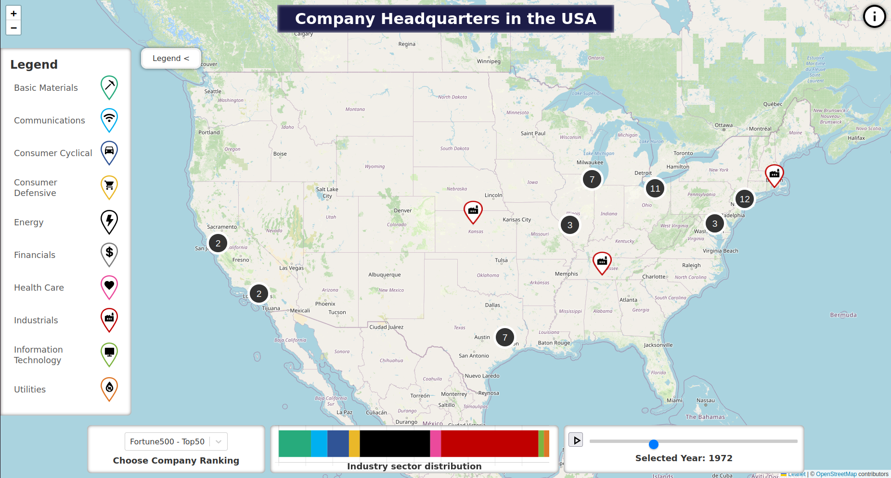
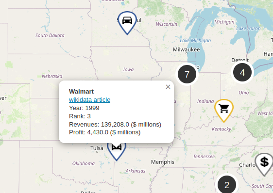

# Company Headquarters in the USA
The objective of this university project is to demonstrate how the US industry has changed over time, as represented by the major corporate headquarters included in the SP500 or Fortune 500 indices.
The geographical distribution of these headquarters and their respective industry sectors are presented on a map where users can select different years and choose between two indexes.





## Website Hosted on GitHub Pages
Explore the deployed website:
<a href="https://jonasgreim.github.io/leaflet-map-project/" target="_blank">Click here to visit</a>

*This website is optimized for desktop use and may not function as expected on mobile devices.*

## Data
The data scraping and processing part of this project is split up into another repository. 

You can find it [here](https://github.com/JonasGreim/US-headquarter-locations).


## Getting Started

To get a local copy up and running, follow these simple steps.

### Installation

1. Install/use a node version >= v18.17.0

2. Install packages
   ```sh
   npm install
   ```
3. Run the website 
    ```sh
    npm run start
    ```
4. Open your browser and go to http://localhost:3000/
5. Enjoy and explore the website!

### Built with
- React
- Leaflet

## Credits 
- Jiacheng Lang & Jonas Greim
- The university course "Computational Spatial Humanities," taught by Dr. Thomas Efer at the University of Leipzig
